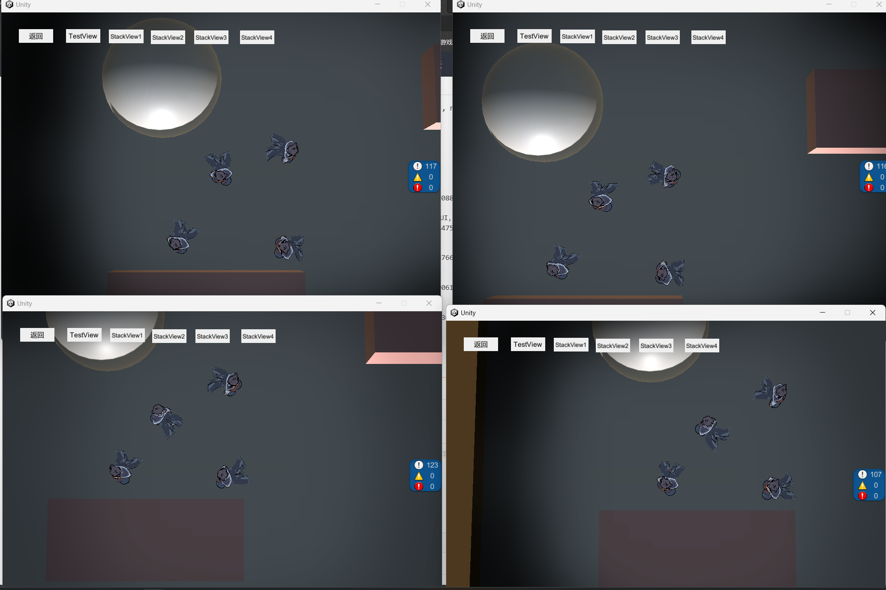

# U3D+HybridCLR+YooAssate+FGUI 简易框架

#### 介绍
**UxGame 是一个包含一整套 C#热更和资源热更的简易框架** 
##
包含事件管理器、定时器管理器、红点管理器、UI管理器、编辑器可视化查看、一键打包功能等
#### 模块
模块是单例对象，是数据的存放处，和与Socket交互的地方。继承ModuleBase且挂载Module特性的对象会被作为一个模块。

```
[Module]
public class LoginModule : ModuleBase<LoginModule>
{
    protected override void OnInit()
    {
        base.OnInit();
    }
}
```


<details> <summary>事件管理器</summary>
事件驱动，常见的观察者模式核心部分。可通过注册监听消息，来实现模块间的解耦和数据更改。
消息的监听和派发并不是同步的，管理器内部有参数可以调整，一帧最多派发多少的消息

```
[Module]
public class LoginModule : ModuleBase<LoginModule>
{
    protected override void OnInit()
    {
        base.OnInit();
        long key = EventMgr.Ins.On(EventType.Test, this, Test);//监听Test消息类型的消息
        EventMgr.Ins.RemoveByKey(key);//取消此Key的监听事件
        EventMgr.Ins.Off(EventType.Test, this, Test);//取消监听Test消息类型的消息
        EventMgr.Ins.OffAll(this);//取消所有此this上的所有监听事件
        EventMgr.Ins.Send(EventType.Test);//派发消息

        //如果要监听带参数的，也可以使用泛型监听
        EventMgr.Ins.On<string>(EventType.Test,this, TestStr);//监听带参数的消息
        EventMgr.Ins.Send(EventType.Test, "test");//带参数的消息派发
    }
    //在模块和UI中，可使用特性快速监听事件，但是此方式注册的事件将无法销毁，是长存的。
    //除非你调用了EventMgr.Ins.OffAll(this)
    [Evt(EventType.Test)]
    void Test()
    {
    }
    //带参数的也可以使用特性快速监听，不需要指定类型，但是派发消息时，需要跟参数类型对应
    [Evt(EventType.Test)]
    void TestStr(string str)
    {
    }
}

```
</details>

<details> <summary>定时器管理器</summary>
定时器，可按照注册的频率和触发次数完成回调的管理器
定时器有4种，时间、帧数、时间戳、Corn表达式

```
//每5秒执行Test方法，执行1次
long Key = TimeMgr.Ins.DoTimer(5, 1,this, Test);
//每5秒执行Test方法，执行10次，执行完毕后触发TestComplete回调
TimeMgr.Ins.DoTimer(5, 10,this, Test,TestComplete);

//每5帧执行Test方法，执行1次
TimeMgr.Ins.DoFrame(5, 1,this, Test);
//每5帧执行Test方法，执行10次，执行完毕后触发TestComplete回调
TimeMgr.Ins.DoFrame(5, 10, this,Test,TestComplete);
//达到时间戳后触发
TimeMgr.Ins.DoTimeStamp(DateTime.Now, this, Test);
//基于Cron表达式，监听触发事件
TimeMgr.Ins.DoCron("0 0/2 * * * ?", this, Test);

//可以通过注册时返回的Key取消注册
TimeMgr.Ins.RemoveKey(Key);

//指定取消Test方法的定时器
TimeMgr.Ins.RemoveTimer(Test);
TimeMgr.Ins.RemoveFrame(Test);
TimeMgr.Ins.RemoveTimeStamp(Test);
TimeMgr.Ins.RemoveCron(Test);

//取消注册在次对象上的所有定时器
TimeMgr.Ins.RemoveAll(this);


```
</details>

<details> <summary>红点管理器</summary>
红点系统，此红点系统以树形结构，以事件驱动检测，子红点检查True时，将不会检测其他子红点

```
//继承TagGroup的可以作为红点的上级树
[Tag]
public class TagTest : TagGroup
{
    protected override void OnInitChildren()
    {
        AddChild<TagTsetChild>();//添加单例子红点
        AddChild<TagTsetChildDym>(1,null);//添加动态子红点
    }
}
[Tag]
public class TagTsetChild : TagBase
{
    protected override IList<int> EvtTypes()
    {
        //监听重新检查的事件，当有此消息派发时，红点会重新检测
        return new List<int>(){(int)EventType.Test};
    }
    protected override bool OnCheck()
    {
        //业务逻辑处理是否红点
        return true;
    }
}
//实现Tag特性后，此红点为单例红点，可通过TagMgr.Ins.GetTag获取红点对象
var tag = TagMgr.Ins.GetTag<TagTest>();
//绑定显示对象和红点，当红点变化时，对象会自动显示或隐藏
TagMgr.Ins.On(tag,GObject);

//有时候我们的红点不并确认，可能需要读表或是其他时候才知道需要注册红点，此时可以注册动态红点，动态红点不需要实现Tag特性，但是获取此红点的时候，需要先拿到父红点，以此类推下来

//实现Tag特性后，此红点为单例红点，可通过TagMgr.Ins.GetTag获取红点对象
var tag = TagMgr.Ins.GetTag<TagTest>();
var tagChild = tag.Find<TagTsetChildDym>(1);
//绑定显示对象和红点，当红点变化时，对象会自动显示或隐藏
TagMgr.Ins.On(tagChild ,GObject);

public class TagTsetChildDym : TagBase
{
    protected override IList<int> EvtTypes()
    {
       //监听重新检查的事件，当有此消息派发时，红点会重新检测
        return new List<int>(){(int)EventType.Test};
    }
    protected override bool OnCheck()
    {
        //业务逻辑处理是否红点
        return true;
    }
}
```
</details>

<details> <summary>UI</summary>
UI是基于FGUI构造的一个系统，且可懒加载的UI框架。

通过工具栏->UxGame->构建->UI->代码生成，可快速通过FGUI包里的组件生成代码。

组件的字段是否生成都可以可视化操作。

UI主要有4个类型
- 普通界面是普通的GComponetn生成的,继承于UIView
- 弹窗则又GWindow生成，继承于UIWindow
- 对话框，继承于UIDialog.
- 子界面继承于UITabView。子界面可指定对于的父界面（UIView、UIWindow),被指定的父界面，则需要拥有特定的组件UITabFrame。

UITabFrame是一个约定好的组件，里面需要一个子界面的容器，一个标签列表（用于切换子界面），一个关闭按钮。这些都是可以通过工具栏的可视化代码生成而指定的。


生成出来的代码会给你指定资源包和所属资源组件，且给生成按钮对应的点击事件（可选择是否生成）

```
//自动生成的代码，请勿修改!!!
using FairyGUI;
namespace Ux.UI
{
	[Package("Multiple","Common")]
	[Lazyload("lazyload_multiple")]
	public partial class MultipleView : UIView
	{
		protected override string PkgName => "Multiple";
		protected override string ResName => "MultipleView";

		protected Common1TabFrame mCommonBg;
		protected Transition t0;
		protected Transition t1;
		protected override void CreateChildren()
		{
			try
			{
				var gCom = ObjAs<GComponent>();
				mCommonBg = new Common1TabFrame(gCom.GetChildAt(0), this);
				t0 = gCom.GetTransitionAt(0);
				t1 = gCom.GetTransitionAt(1);
			}
			catch (System.Exception e)
			{
				 Log.Error(e);
			}
		}
		public override void AddChild(UITabView child)
		{
			mCommonBg?.AddChild(child);
		}
		protected void RefreshTab(int selectIndex = 0, bool scrollItToView = true)
		{
			mCommonBg?.Refresh(selectIndex,scrollItToView);
		}
		protected UITabView GetCurrentTab()
		{
			return mCommonBg?.SelectItem;
		}
		protected void SetTabRenderer<T>() where T : UITabBtn
		{
			mCommonBg?.SetTabRenderer<T>();
		}
	}
}

```

```
//UI特性，注册了此特性的UI界面可以通过 UIMgr.Ins.Show打开
    [UI]
    partial class MultipleView
    {
        //public override bool IsDestroy => false;
        protected override UILayer Layer => UILayer.Normal;
        protected override IUIAnim ShowAnim => new UITransition(t0);
        protected override IUIAnim HideAnim => new UITransition(t1);

        protected override void OnShow(object param)
        {
            base.OnShow(param);
        }

        protected override void OnHide()
        {
            base.OnHide();
        }
    }
//注册UI，且指定父类为MultipleView
    [UI(typeof(MultipleView))]
    [TabTitle("T1")]
    partial class Multiple1TabView
    {
    }
//注册UI，且指定父类为MultipleView
    [UI(typeof(MultipleView))]
    [TabTitle("T2")]
    partial class Multiple2TabView
    {
    }
//注册UI，且指定父类为MultipleView
    [UI(typeof(MultipleView))]
    [TabTitle("T3")]
    partial class Multiple3TabView
    {

    }

//打开界面
UIMgr.Ins.Show<MultipleView>();
```


```
//如上就可以通过标签切换当前显示的子界面，当然也可以直接通过代码打开子界面
UIMgr.Ins.Show<Multiple3TabView>();
```

#### 如何定义懒加载的界面


通过工具栏打开资源分类，可指定哪些包打上懒加载标签，和内置资源。且代码生成界面的时候，会给界面打上懒加载标签特性。
此时打开懒加载的界面时，如果未加载就会先下载资源（编辑器模式下，需要把资源正常打包出去，且YooAssate的模式改为HostPlayMode)


#### 如何动态添加界面
当我们需要开发一些逻辑一样，只是界面不同的需求时，动态界面是很方便的

例如，当我们需要开发一个累计7日登录活动的时候，和一个累计30日登录
这里面其实逻辑是一致的，只是登录的天数不同。这时候可以通过动态的注册界面，换掉对应的界面资源，而保留界面逻辑即可。

```
var par = new UITestData(3333, typeof(LoginTestUI));
UIMgr.Ins.RegisterUI(par);
var data1 = new UITestData(333301, typeof(LoginTestSub), new UITestTabData(3333, "测试2"));
UIMgr.Ins.RegisterUI(data1);
var data3 = new UITestData(333302, typeof(LoginTestSub), new UITestTabData(3333, "测试3"));
UIMgr.Ins.RegisterUI(data3);
```


</details>

<details> <summary>可视化工具</summary>


可视化工具可以让游戏运行时，查看一些状态数据，例如注册了多少UI，当前打开的界面，缓存的界面，待删除界面


当前资源引用


注册的事件


注册的定时器

</details>

<details> <summary>多人游戏</summary>
配合[gox](http://https://gitee.com/xhaoh94/gox)实现的多人联机demo
[输入链接说明](http://)
</details>
